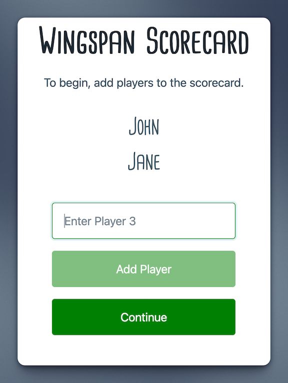
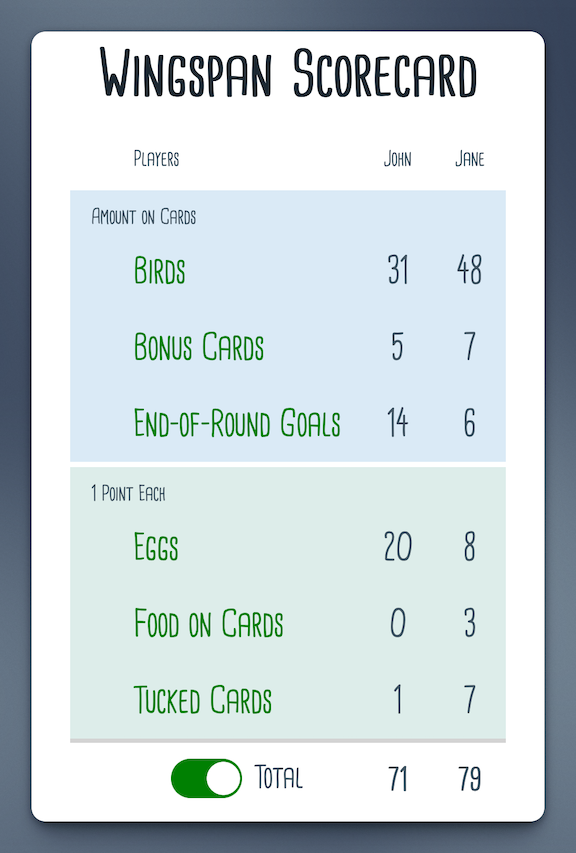

# Windspan Scorecard

A scorecard for the popular game [Wingspan](https://en.wikipedia.org/wiki/Wingspan_(board_game)).

Use this scorecard to quickly enter scores and calculate the total points for each player. This scorecard is in no way affiliated with Wingspan or Stonemaier Games.

## Getting Started

Visit [https://wingspan-scorecard.web.app](https://wingspan-scorecard.web.app) to use the scorecard.

## Authors

Created by Brandon Chupp.

## License
This project is licensed under the MIT License.

## Acknowledgments
***Cardenio Modern*** font created by [Nils Cordes](http://nilscordes.com/).